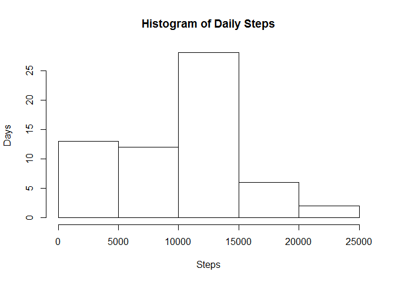
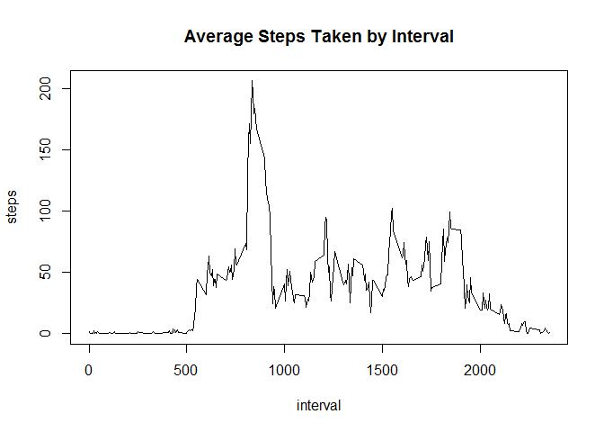
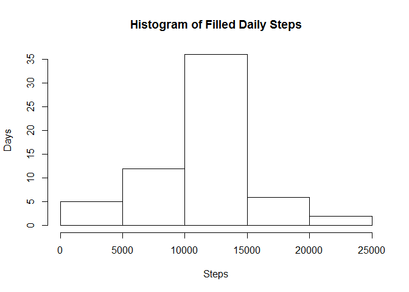
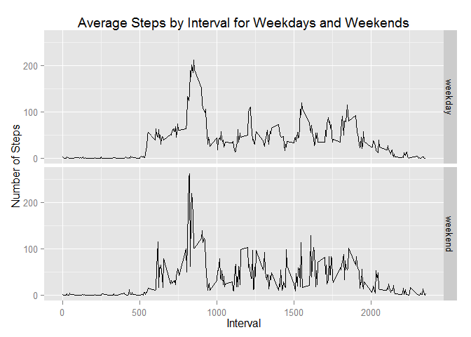

# Reproducible Research: Peer Assessment 1

## Loading and preprocessing the data
To load and process the data, I've done the following:
1. Unzip activity.zip.

```r
if(getwd()!='C:/Stuff/Coursera/RepData_PeerAssessment1'){setwd('C:/Stuff/Coursera/RepData_PeerAssessment1')}

unzip("activity.zip")
```

2. Read activity.csv into variable 'rawData'.

```r
rawData <- read.csv('activity.csv', colClasses = c('integer', 'Date', 'integer'))
```

3. Aggregate total steps to the daily level into variable 'dailySteps' and assign appropriate column names.

```r
dailySteps <- aggregate(rawData$steps, list(rawData$date), sum, na.rm=TRUE)

names(dailySteps) <- c('date', 'steps')
```

4. Aggregate average steps to the interval level into variable 'avgIntervalSteps' and assign appropriate column names.

```r
avgIntervalSteps <- aggregate(rawData$steps, list(rawData$interval), mean, na.rm = TRUE)

names(avgIntervalSteps) <- c('interval', 'steps')
```


## What is mean total number of steps taken per day?
Below is a histogram of the number of steps taken per day.

```r
hist(dailySteps$steps, xlab = 'Steps', ylab = 'Days', main = 'Histogram of Daily Steps')
```

 

Below is the mean of the number of steps taken per day.

```r
mean(dailySteps$steps, na.rm = TRUE)
```

```
## [1] 9354.23
```

Below is the median of the number of steps taken per day.

```r
median(dailySteps$steps, na.rm = TRUE)
```

```
## [1] 10395
```


## What is the average daily activity pattern?
Below is a time series plot of the 5-minute interval (x-axis) and the average number of steps taken.

```r
plot(avgIntervalSteps, type = 'l', main = 'Average Steps Taken by Interval')
```

 

Below is the 5-minute interval that on average across all days contains the maximum number of steps.

```r
avgIntervalSteps[avgIntervalSteps$steps == max(avgIntervalSteps$steps),'interval']
```

```
## [1] 835
```


## Imputing missing values
Note that there are a number of days/intervals where there are missing values (coded as NA). The presence of missing days may introduce bias into some calculations or summaries of the data.

Below is the total number of missing values in the dataset.

```r
sum(is.na(rawData$steps))
```

```
## [1] 2304
```

To fill in all the missing values in the dataset, I will use the mean for that interval across all days and put the final results into variable 'filledData'

```r
mergedData <- merge(rawData, avgIntervalSteps, by.x='interval', by.y='interval')

mergedData$steps <- ifelse(!is.na(mergedData$steps.x), mergedData$steps.x, mergedData$steps.y)

filledData <- mergedData[,c('interval','date','steps')]
```

Now I will aggregate total steps to the daily level from this new dataset into variable 'filledDailySteps', assign appropriate column names, and generate a histogram to compare against our earlier historgram.

```r
filledDailySteps <- aggregate(filledData$steps, list(filledData$date), sum)

names(filledDailySteps) <- c('date', 'steps')

hist(filledDailySteps$steps, xlab = 'Steps', ylab = 'Days', main = 'Histogram of Filled Daily Steps')
```

 

As you can see, the histogram shows more days with more steps taken when missing data is filled in, as expected.


## Are there differences in activity patterns between weekdays and weekends?
First, I assign each row a 'Weekdaytype' of 'weekday' or 'weekend' according to its date.

```r
filledData$weekdaytype <- as.factor(ifelse(weekdays(filledDailySteps$date) %in% c('Saturday','Sunday'), 'weekend', 'weekday'))
```

Then, I average the steps for each interval across every weekday and every weekend and plot it in panels by Weekdaytype.

```r
library(ggplot2)

filledAvgIntervalStepsByWeekdaytype <- aggregate(filledData$steps, list(filledData$interval, filledData$weekdaytype), mean)
names(filledAvgIntervalStepsByWeekdaytype) <- c('interval','weekdaytype','steps')

timeSeriesByWeekdaytype <- ggplot(filledAvgIntervalStepsByWeekdaytype, aes(interval, steps)) + geom_line() + facet_grid(weekdaytype ~ .) + labs(x = "Interval", y = "Number of Steps", title = "Average Steps by Interval for Weekdays and Weekends")

print(timeSeriesByWeekdaytype)
```

 
